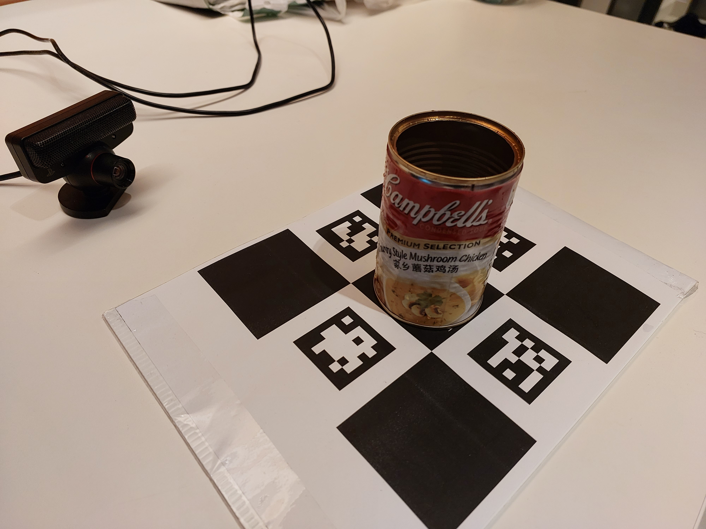
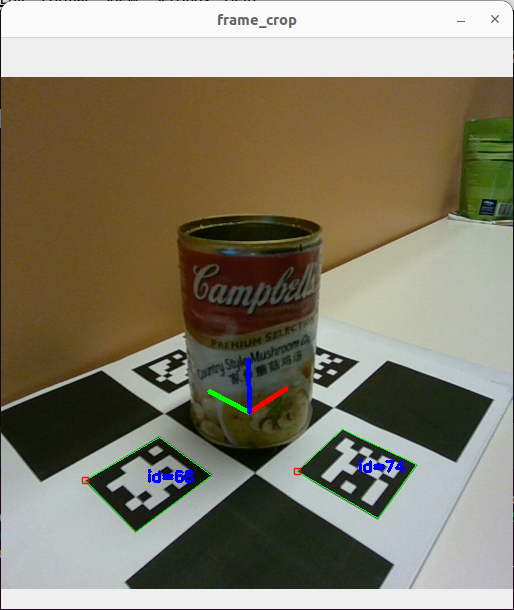

# OnePoseDatasetCollector
Rudimentary custom dataset collector for OnePose.

This dataset collector uses a diamond-shaped aruco board to obtain poses. There are two implementations:
1. `detect_arucoboard_realsense.py` if you are using an Intel Realsense camera. Install the [Realsense SDK](https://github.com/IntelRealSense/librealsense) and its Python wrapper (which can be pip-installed with `pip3 install pyrealsense2`).
2. `detect_arucoboard_opencv.py` if you are using any other camera that can be picked up by `cv2.VideoCapture`. You will need to calibrate your camera and provide the intrinsic matrix as a 3x3 NumPy array, stored as a `.txt` file (with `np.savetxt`), under `configs/intrin/`

Addendum: [OpenCV camera calibration guide](https://docs.opencv.org/4.x/dc/dbb/tutorial_py_calibration.html) here.

## Requirements

Only OpenCV and NumPy are required. Install them using `pip`.

## 1. Configuring the aruco board

The board provided is a diamond-shaped aruco board generated by OpenCV.
You may choose to modify the square length (`sl`) and marker length (`ml`), and the aruco markers themselves of the board by 
adding your own `.json` config, stored in `configs/aruco`. I have provided a sample config (`sl200_ml120.json`).



Run `arucoboard.py` to generate the board as a `.png` file. The file can be found in `out/aruco/`. Example:
```
python3 arucoboard.py --config sl200_ml120
```

Print the `.png` file and lay it flat on a surface.

## 2. Recording your data

Place your desired object in the middle of the board. If the object is too big (covers all 4 aruco markers), you may wish to generate a board with smaller aruco markers by changing the `ml` parameter in the config file.



#### 2.1 Intel Realsense Cameras

Simply run `detect_arucoboard_realsense.py`, specifying the aruco board config file you used to generate your board with `--config` and the name of the dataset you wish to save it as with `--name`.
Example:
```
python3 detect_arucoboard_realsense.py --config sl200_ml120 --name empty
```

Save the image, the corresponding intrinsic matrix and the pose by pressing `spacebar`. Press `q` to quit the program.

Your dataset is saved in `out/datasets/`.

#### 2.2 Other Cameras

You will need to place your camera intrinsic file in `configs/intrin`.

Run `detect_arucoboard_opencv.py`. You will need to specify your camera parameters as flags. Example:
```
python3 detect_arucoboard_opencv.py --intrin intrin_ps3 --width 640 --height 480 --camidx 0 --config sl200_ml120 --name empty
```

Change `--camidx` to choose your desired camera if you have multiple cameras.

Save the image, the corresponding intrinsic matrix and the pose by pressing `spacebar`. Press `q` to quit the program.

Your dataset is saved in `out/datasets/`.

## Acknowledgement
Most of the functions in `utils.py` used for cropping and obtaining post-crop intrinsics are taken from the [original OnePose repository](https://github.com/zju3dv/OnePose).
